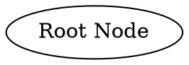
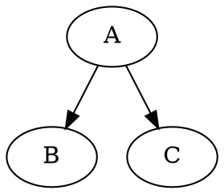
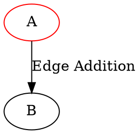
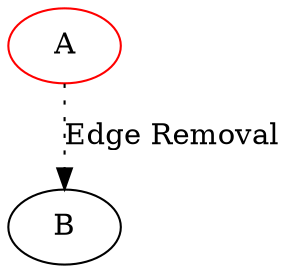
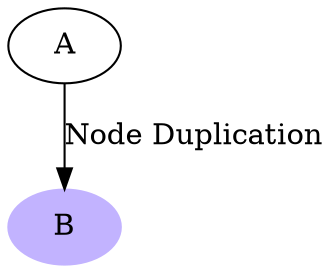
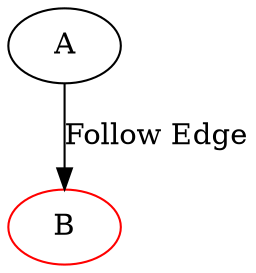
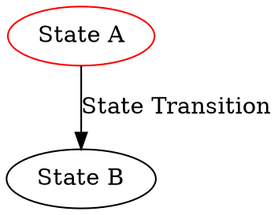

# Graph-Based Runtime System: A Turing-Complete Model

## Introduction

This document presents a unique graph-based runtime system that embodies a Turing-complete model. It establishes computation using graph structures where nodes represent state and edges symbolize transitions or operations. The simplicity of this model combined with its expressive power enables a wide array of computational semantics, data representation, and control flow mechanisms.

## The Model

### Initial Configuration

The system starts with a single node devoid of edges. A movable read head or "cursor" keeps track of the current or root node and the instruction under execution.

### Node Structure

Nodes in this model are defined by their edges. Each edge represents an action or a transition to another state (node).

### Operations

The model supports four fundamental operations that modify the graph's structure and state:

1. **Add an Edge:** Attach an edge of a known type to the current node, pointing towards a known target. This operation also moves the root node to the address of this new node.

2. **Remove an Edge:** Detach a specified edge from the current node. This operation moves the root node to the address of the node after edge removal.

3. **Duplicate Node:** Make a copy of the current node and add an edge from the new node to the original. This operation moves the root node to the address of the new node.

4. **Follow Edge:** Traverse through a specified edge. This operation moves the edge name into the instruction register and changes the root node to the target node.

## Turing Completeness

To prove Turing completeness, we must demonstrate that our system can simulate any Turing machine. Given the expressiveness of the operations in this model, it's feasible to construct an equivalent Turing machine for any arbitrary computation. 

For instance, consider a Turing machine with a state represented by a node and transitions modeled by edges. By manipulating nodes and edges using the operations defined in our model, we can simulate all the actions of the Turing machine, including changing states (following edges), writing symbols (adding/removing edges), and moving the head (changing the root node).

This alignment of operations indicates that the proposed graph-based model is Turing-complete, as it can simulate the operations of a Turing machine. This validates its potential as a universal model of computation, providing a unique combination of expressive power and structural simplicity.
